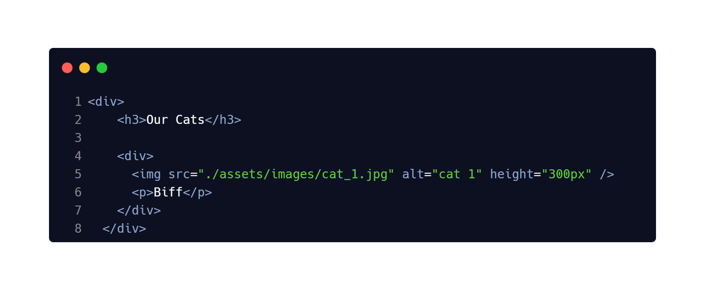
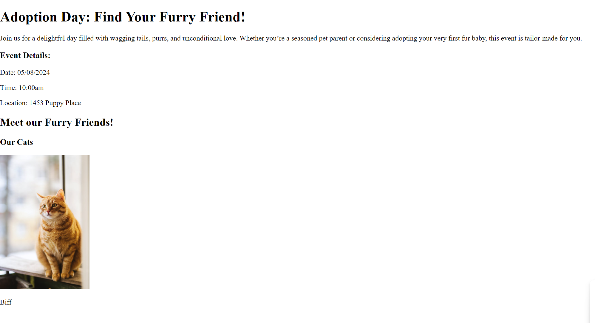
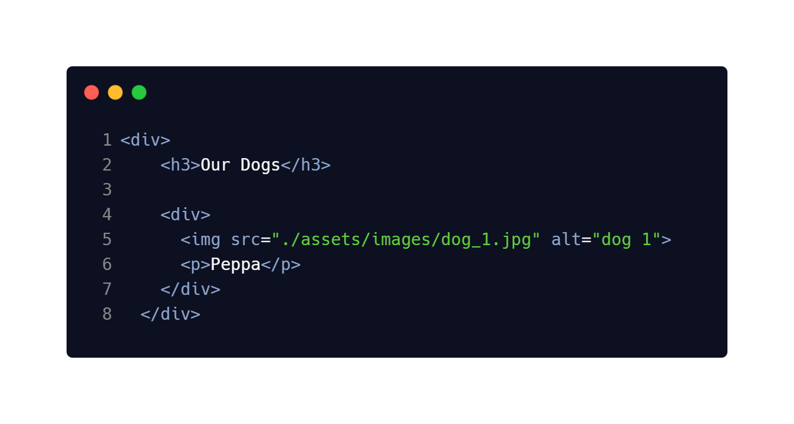

# Adoption Day

## Description 📄
This lab is designed as a thorough review of everything we've learned in HTML so far. We will be creating an adoption site for cats and dogs.

---

## ToDo list ✅
**Attention**: When you complete a task, put an `x` in the middle of the brackets to mark it off your ToDo list.

[ ] Create an `index.html` file, type `!` and hit `enter` to create your boilerplate `html`.

[ ] Create a `<h1>` tag with the text content set to `Adoption Day: Find Your Furry Friend!`.

[ ] Now we need a description for the event. Create a `
` tag and set the text content to `Join us for a delightful day filled with wagging tails, purrs, and unconditional love. Whether you’re a seasoned pet parent or considering adopting your very first fur baby, this event is tailor-made for you.`

[ ] Any event needs to have details such as location, date, and time. Create a `<h3>` header and put `Event Details:`. We'll need to follow up with relevant data such as in the screenshot.

[ ] We need showcase the animals we have available for adoption. To do this we'll create sections using `
` tags which serve as containers for structuring content in a webpage.

So far everything should look similar to the following

[ ] Now that we have the first cat on the page, let's do the same for the other two cats in the `assets/images` folder. Follow the same pattern as the first cat. Each cat's `img` and `p` tags should be nested in a `div` tag.

[ ] Almost there! All that is left is to complete the dogs. The pattern is the exact same as with the cats, just make sure the `img` tags `src` attribute is set to the dogs' images in the `assets/images` folder.

---

## Attribution
